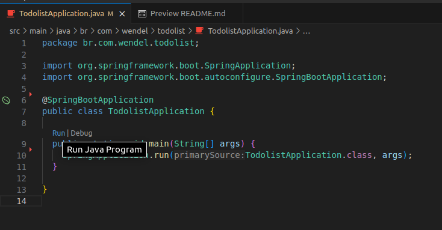

# TodoList-back-end

<h4 align="center"> 
	TodoList - Back-end
</h4>

<p align="center">
 <a href="#-sobre-o-projeto">Sobre</a> •
 <a href="#-funcionalidades">Funcionalidades</a> •
 <a href="#-Configuração-do-ambiente">Configuração do ambiente</a> • 
 <a href="#-como-executar">Como executar</a> • 
 <a href="#-tecnologias">Tecnologias</a> 
</p>

---

## :ringed_planet: Sobre o projeto

Este projeto é um back-end de uma aplicação de lista de tarefas (to-do list) que pode ser integrado por qualquer pessoa em seus projetos de front-end.

---

## 💻 Funcionalidades
 
- [x] Criar um usuário com as seguintes permissões:
  - [x] Visualizar suas tarefas;
  - [x] Atualizar suas tarefas;
  - [x] Adicionar novas tarefas.

---

## 🎨 Configuração do ambiente

### Linux (Ubuntu)

#### Java 17 

```bash

# 1 - Abrir um terminal (CTRL + ALT + T)

# 2 - Digitar o seguinte comando 

sudo add-apt-repository ppa:linuxuprising/java

## Aceitar os termos, apertando ENTER

# 3 - Atualizar o gerenciador de pacotes

sudo apt-get update

# 4 - Instalar o Java 17

sudo apt-get install oracle-java17-installer --install-recommends

# 5 - Pra ter certeza se o Java está instalado

java -version

### Observação.

### Se por acaso o Java não estiver sendo reconhecido no terminal, adicione o JAVA_HOME nas variáveis do seu bashrc 

export JAVA_HOME=/usr/lib/jvm/java-17-openjdk-amd64

```

#### Maven

```bash

# 1 - Atualize os pacotes

sudo apt-get update

# 2 - Instale o maven com o seguinte comando

sudo apt-get -y install maven

# O maven deverá ser instalado em um dos seguintes caminhos **/usr/share/maven** ou **/etc/maven**

# Para verificar se o maven foi instalado com sucesso, acessar o terminar e digitar

mvn -version

```

#### VSCode

```bash

# A instalação do VSCode pode ser feita através do link abaixo:

https://code.visualstudio.com/Download

# Extensão para auxiliar no reconhecimento do projeto.

- vscjava.vscode-java-pack
- vscjava.vscode-spring-initializr
- vmware.vscode-spring-boot
- vscjava.vscode-spring-boot-dashboard

```

#### Rest Client

```bash

# Nessa documentação temos algumas opções de ferramentas para requisições REST

# API Dog

https://apidog.com/download/

# API Insomnia 

https://insomnia.rest/download

# API Postman

https://www.postman.com/downloads/

```

---

## 🚀 Como executar

### Pré-requisitos

Ter feito a configuração do ambiente.

### Execução

Clicar em run no arquivo src/main/java/br/com/wendel/todolist/TodoListApplication.java

<p align="center">
  
</p>

---

## 🛠 Tecnologias

#### **Back-End**  ([JAVA](https://docs.oracle.com/en/java/))

-   **[Maven](https://maven.apache.org/)**
-   **[Spring Framework](https://spring.io/projects/spring-framework)**
-   **[Spring Data JPA](https://spring.io/projects/spring-data-jpa)**
-   **[Lombok](https://projectlombok.org/)**
-   **[H2 Banco](https://www.h2database.com/html/main.html)**